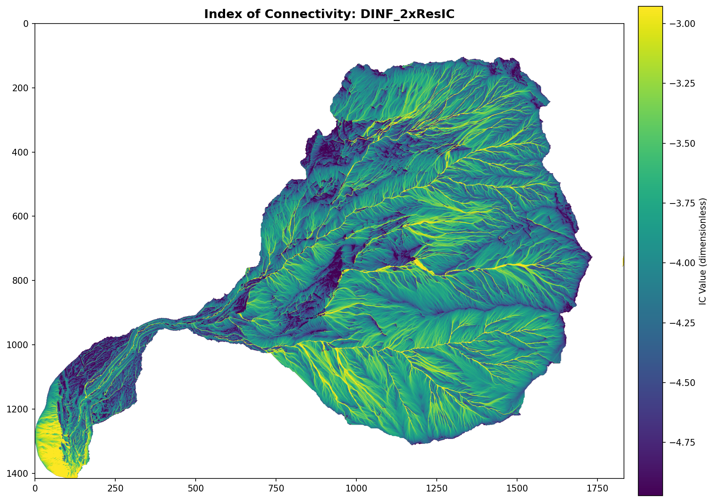
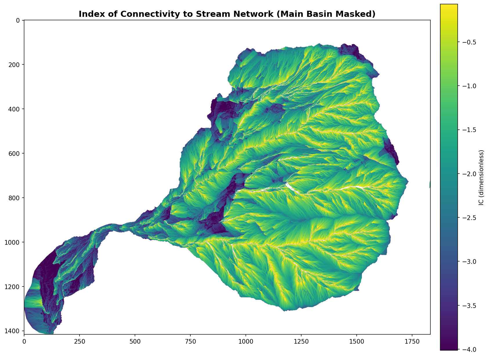

# GeomorphConn

[](https://badge.fury.io/py/geomorphconn)
[](https://github.com/manudeo/GeomorphConn/actions)
[](https://codecov.io/gh/manudeo/GeomorphConn)
[](https://joss.theoj.org)
[](LICENSE)

**GeomorphConn** is an open-source Python package that implements the
[Index of Connectivity (IC)](https://doi.org/10.1016/j.geomorph.2012.05.010)
(Cavalli et al., 2013) as a [Landlab](https://landlab.readthedocs.io)-type workflow,
extended with NDVI- and rainfall-based hydrological weights (Dubey et al., in prep.). It also provides a
Google Earth Engine (GEE) data-fetching module so that all required inputs — DEM,
NDVI, and rainfall — can be retrieved directly from the cloud for any catchment on
Earth.

---

## Key features

| Feature | Detail |
|---|---|
| **IC toward outlet** | Standard Cavalli et al. (2013) formulation |
| **IC toward target** | Compute IC relative to a river/lake shapefile (any geopandas-readable format) |
| **Hydrological weights** | W = f(RF_norm, NDVI-C-factor) — extends purely topographic/land-cover weighting |
| **Flow direction options** | D8 (steepest), D-infinity, Multiple-Flow-Direction (MFD) via Landlab |
| **TauDEM backend (optional)** | External TauDEM+MPI routing backend for outlet/target IC (`compute_backend="taudem"`) |
| **GEE data fetching** | DEM: SRTM / CopDEM-30 / MERIT-DEM; Rainfall: CHIRPS / ERA5 / PERSIANN; NDVI: Landsat-8/9 / Sentinel-2 |
| **ArcGIS tools** | Identical workflows provided as an ArcGIS Pro toolbox (`arcgis_tools/`) |
| **Speed** | Optional `numba` JIT compilation for O(N) traversal loops |

---

## Installation

See **[INSTALLATION.md](INSTALLATION.md)** for full instructions including
virtual-environment setup, optional extras, system requirements, and ArcGIS
Pro toolbox setup.

**Quick start (from source):**
```bash
git clone https://github.com/manudeo/GeomorphConn.git
cd GeomorphConn
python -m venv .venv && .venv\Scripts\activate  # Windows
pip install -e ".[gui]"
```

See [TROUBLESHOOTING.md](TROUBLESHOOTING.md) for common install, GUI, alignment,
and target-vector issues, including a stable Windows + WSL + conda TauDEM setup.

---

## Docs map

Detailed documentation is kept in [docs/README.md](docs/README.md) to keep this main README concise.

- Outlet workflow: [docs/outlet.md](docs/outlet.md)
- Target workflow: [docs/target.md](docs/target.md)
- CLI usage: [docs/cli.md](docs/cli.md)
- GUI usage: [docs/gui.md](docs/gui.md)
- CLI and GUI options reference: [docs/options.md](docs/options.md)

### CLI (quick)

```bash
geomorphconn run --dem dem.tif --ndvi ndvi.tif --rainfall rainfall.tif --outputs IC
```

TauDEM backend example:

```bash
geomorphconn run --dem dem.tif --ndvi ndvi.tif --rainfall rainfall.tif --compute-backend taudem --taudem-n-procs 8 --outputs IC Dup Ddn
```

TauDEM installation check:

```bash
geomorphconn taudem-check --taudem-bin-dir "C:\Program Files\TauDEM\TauDEM5Exe"
```

### GUI (quick)

```bash
geomorphconn gui --backend streamlit
```

For full command and option details, use the docs links above.

### Future TODOs (planned)

- Add `geomorphconn gee fetch ...` command for CLI-native GEE retrieval.
- Add `geomorphconn run --from-gee ...` pipeline (fetch + compute in one command).
- Add GUI controls for bounds/date/source/project to run GEE fetch and IC in one workflow.
- Add a desktop/clickable GUI launcher (double-click icon/shortcut, no terminal required).
- Add optional SCI-inspired mobility mode (rainfall + soil stability + land use + ruggedness; cf. Zingaro et al., 2019, https://doi.org/10.1016/j.scitotenv.2019.03.461) as an advanced workflow, while keeping the default workflow minimal-data.
- Add optional IHC-inspired event mode (runoff/CN and antecedent-rainfall weighting with RS-style impedance; cf. Zanandrea et al., 2021, https://doi.org/10.1016/j.catena.2021.105380) as an advanced workflow, while keeping the default workflow minimal-data.
- Support reading all gridded formats supported by xarray where possible, with clear warnings/errors when extra backend dependencies are required.
- Add time-series IC mode in GUI and CLI: accept time-varying grids (e.g., NetCDF); if data are single-time or 2D, treat them as static inputs across all requested timesteps.
- Add SedConnect as a [Landlab](https://landlab.readthedocs.io) component.

---

## Quick start
### Fast start (high-level API)
```python
from geomorphconn import run_connectivity_from_rasters

result = run_connectivity_from_rasters(
    dem="dem.tif",
    weight=["ndvi.tif", "rainfall.tif"],
    ic_mode="outlet",   # or "target"
    flow_director="DINF",
    fill_sinks=True,
    auto_project_to_utm=True,
)

result["dataset"]["IC"].rio.to_raster("IC.tif")
```

TauDEM backend from API:

```python
from geomorphconn import run_connectivity_from_rasters

result = run_connectivity_from_rasters(
    dem="dem.tif",
    ndvi="ndvi.tif",
    rainfall="rainfall.tif",
    compute_backend="taudem",
    taudem_n_procs=8,
    taudem_bin_dir=r"C:\Program Files\TauDEM\TauDEM5Exe",
)
```

Detailed guides:

- Outlet workflow details: [docs/outlet.md](docs/outlet.md)
- Target workflow details: [docs/target.md](docs/target.md)

GEE details are also covered in the outlet guide, including:

- `GEEFetcher.fetch(return_xarray=True)`
- `GEEFetcher.fetch_timeseries(resampling="monthly" | "seasonal" | "annual")`

### Google Earth Engine authentication (local setup)

`GeomorphConn` uses your local Earth Engine credentials. Authenticate once in your Python environment:

```bash
earthengine authenticate
earthengine set_project add-your-GEE-project-name
```

You can also authenticate from Python:

```python
import ee
ee.Authenticate()
ee.Initialize(project="add-your-GEE-project-name")
```

In notebooks, set:

```python
GEE_PROJECT = "add-your-GEE-project-name"
```

---

## Weight scenarios

`GeomorphConn` supports DEM-only and mixed weighting through the `geomorphconn.weights` builders/presets.

| Scenario name | Includes | Typical builder/preset |
|---|---|---|
| `roughness_only` | DEM roughness only | `preset_roughness_only(grid)` |
| `rainfall_only` | Rainfall only | `WeightBuilder().add(RainfallWeight(rainfall_nodes))` |
| `ndvi_only` | NDVI only | `WeightBuilder().add(NDVIWeight(ndvi_nodes))` |
| `ndvi_rainfall` | NDVI + Rainfall | `preset_rainfall_ndvi(rainfall_nodes, ndvi_nodes)` |
| `ndvi_rainfall_roughness` | NDVI + Rainfall + DEM roughness | `preset_rainfall_ndvi_roughness(rainfall_nodes, ndvi_nodes, grid)` |

These five scenarios are demonstrated in:

- `notebooks/01_IC_outlet_GEE_demo.ipynb` (IC toward outlet)
- `notebooks/02_IC_target_demo.ipynb` (IC toward target feature)
- `notebooks/03_IC_software_comparison.ipynb` (cross-software agreement and diagnostics)

Expected output artifacts:

- `notebooks/01_IC_outlet_GEE_demo.ipynb` writes to `output_nb1/`:
    - `IC_outlet_<scenario>.tif`, `W_<scenario>.tif`, `S_<scenario>.tif`, `Dup_<scenario>.tif`, `Ddn_<scenario>.tif`
    - `IC_weight_scenarios.png`, `IC_outlet_final.png`, `weight_scenarios_summary.csv`
- `notebooks/02_IC_target_demo.ipynb` writes to `output_nb2/`:
    - `IC_outlet_<scenario>.tif`, `IC_target_<scenario>.tif`, `IC_delta_<scenario>.tif`
    - `W_<scenario>.tif`, `Dup_<scenario>.tif`, `Ddn_<scenario>.tif`
    - `IC_outlet_vs_target.png`, `weight_scenarios_summary.csv`
- `notebooks/03_IC_software_comparison.ipynb` writes to `outputs/ic_comparison/`:
    - `comparison_metrics.csv`, `comparison_tests.csv`
    - `maps_and_differences.png`, `histograms_and_hexbin.png`, `bland_altman.png`
    - optional stratified outputs (`stratified_metrics_*.csv`, `stratified_*.png`) if stratification rasters are provided
    - disconnectivity outputs (`disconnectivity_nodes.csv`, `disconnectivity_links.csv`, `disconnectivity_node_metrics.csv`, related figures)

---

## Repository structure

```
GeomorphConn/
├── geomorphconn/                   # Package source
│   ├── components/
│   │   └── connectivity_index.py   ← Landlab Component (core algorithm)
│   ├── gee/
│   │   └── fetcher.py              ← GEE/xee data fetcher
│   ├── utils/
│   │   └── target.py               ← Target shapefile rasterization
│   └── weights/
│       └── builder.py, components.py, tables.py
├── docs/                           # Documentation and examples
│   ├── README.md                   ← Docs index
│   ├── outlet.md, target.md, cli.md, gui.md, options.md
│   └── assets/
│       ├── geomorphconn_GUI.pdf    ← GUI reference
│       ├── IC_Outlet_DINF.png      ← Moscardo outlet example
│       └── IC_Target5k_DINF.png    ← Moscardo target example
├── notebooks/
│   ├── 01_IC_outlet_GEE_demo.ipynb ← Full workflow: GEE fetch → IC outlet
│   ├── 02_IC_target_demo.ipynb     ← IC toward river / lake target
│   └── 03_IC_software_comparison.ipynb ← Outlet vs target vs ArcGIS
├── arcgis_tools/
│   ├── ConnectivityTools.atbx       ← ArcGIS Pro toolbox (outlet + target)
│   └── README.md
├── paper/
│   ├── paper.md                    ← JOSS manuscript
│   └── paper.bib
└── tests/
    └── test_connectivity_index.py
```

---

## ArcGIS tools

For users without a Python/Jupyter workflow, identical IC calculations are provided
as an ArcGIS Pro toolbox in `arcgis_tools/`. These require ArcGIS Pro
with Spatial Analyst, 3D Analyst, and Image Analyst licences. See
[`arcgis_tools/README.md`](arcgis_tools/README.md) for usage instructions.

---

## Example Results

GeomorphConn has been applied to the **Moscardo catchment**, a highly active debris-flow system in the Italian Alps.
The example below demonstrates IC computation at **1 m resolution (coarsened to 2 m)** using D-infinity flow routing
with `DepressionFinderAndRouter` and surface roughness impedance weights (Cavalli and Marchi, 2008).

### Moscardo Catchment, Italian Alps (Italy)

**Study area:** 1,417 × 1,833 cells @ 2 m resolution; 2,589 km² projected extent

#### IC toward outlet (no target constraint)



**Parameters:**
- Flow director: D-infinity (distributed multi-receiver flow)
- Depression handler: DepressionFinderAndRouter (routes through pits without modifying DEM)
- Weights: Surface roughness impedance (Cavalli and Marchi, 2008)
- No explicit target; IC computed toward basin outlet
- Grid: 1,417 rows × 1,833 cols @ 2 m resolution

**IC statistics:**
- Min / Max: –6.93 / –1.10
- Mean ± Std: –3.98 ± 0.46
- Valid cells: 1,059,874 / 2,589,910 (41%)
- Ddn extremely high (up to 86,117 m) in low-connectivity areas
- IC values are consistently negative in this steep, high-relief basin due to high downstream impedance

#### IC toward 1,000-cell stream network (main basin masked)



**Parameters:**
- Flow director: D-infinity
- Depression handler: DepressionFinderAndRouter
- Weights: Surface roughness impedance (Cavalli and Marchi, 2008)
- Main-basin-only masking: Enabled (dominant outlet footprint)
- Target: Auto-detected stream network (cells draining ≥1,000 upslope cells)
- Grid: 1,417 rows × 1,833 cols @ 2 m resolution

**IC statistics:**
- Min / Max: –6.30 / +1.24
- Mean ± Std: –1.64 ± 0.93
- Valid cells: 1,037,176 / 2,589,910 (40%)
- Main-basin masking removes neighbouring catchments outside the dominant outlet basin
- IC range remains negative-to-positive, highlighting spatially variable connectivity to the stream network

---

## Citation

### Required citations

If you use this software, please cite:

> Singh, M., Cavalli, M. & Crema, S. (2026). GeomorphConn: A Python Package for
> Hydrologically-Weighted Index of Connectivity. *Journal of Open Source
> Software*. https://doi.org/10.21105/joss.XXXXX (TO BE SUBMITTED)

And the original IC formulation:

> Cavalli, M., Trevisani, S., Comiti, F., & Marchi, L. (2013). Geomorphometric
> assessment of spatial sediment connectivity in small Alpine catchments.
> *Geomorphology*, 188, 31–41. https://doi.org/10.1016/j.geomorph.2012.05.010

And the original IC software (SedInConnect):

> Crema, S. & Cavalli, M. (2018). SedInConnect: a stand-alone, free and open
> source tool for the assessment of sediment connectivity. *Computers &
> Geosciences*, 111, 39–45. https://doi.org/10.1016/j.cageo.2017.10.009

And the NDVI/rainfall hydrological-weight extension used in GeomorphConn:

> Dubey, A., Singh, M., & Jain, V. (in prep.). Understanding Sediment Dynamics in Large River Basins with the Effect of Hydro-sedimentological Connectivity Index.

### Related references

> Singh, M., Tandon, S. K., & Sinha, R. (2017). Assessment of connectivity in a
> water-stressed wetland (Kaabar Tal) of Kosi-Gandak interfan, north Bihar
> Plains, India. *Earth Surface Processes and Landforms*, 42(12), 1982-1996.
> https://doi.org/10.1002/esp.4156

> Singh, M., & Sinha, R. (2019). Evaluating dynamic hydrological connectivity of
> a floodplain wetland in North Bihar, India using geostatistical methods.
> *Science of The Total Environment*, 651, 2473-2488.
> https://doi.org/10.1016/j.scitotenv.2018.10.139

> Singh, M., Sinha, R., & Tandon, S. K. (2020). Geomorphic connectivity and its
> application for understanding landscape complexities: a focus on the
> hydro-geomorphic systems of India. *Earth Surface Processes and Landforms*,
> 46(1), 110-130. https://doi.org/10.1002/esp.4945

> Singh, M., Sinha, R., Mishra, A., & Babu, S. (2022). Wetlandscape
> (dis)connectivity and fragmentation in a large wetland (Haiderpur) in west
> Ganga plains, India. *Earth Surface Processes and Landforms*, 47(8), 1872-1887.
> https://doi.org/10.1002/esp.5352

> Singh, M., & Sinha, R. (2022). Integrating hydrological connectivity in a
> process-response framework for restoration and monitoring prioritisation of
> floodplain wetlands in the Ramganga Basin, India. *Water*, 14(21), 3520.
> https://doi.org/10.3390/w14213520

---

## Disclaimer

This software is provided "as is", without warranties or guarantees of any kind (express or implied), and the authors are not liable for any direct or indirect damages arising from its use.

---

## Contributing

Contributions welcome — please open an issue or pull request on GitHub.

---

## Acknowledgements

M. Singh is supported by the Royal Society Newton International Fellowship
(NIF\R1\232344) and was previously an Alexander von Humboldt Research Fellow
at the University of Potsdam. The IC methodology was developed by Marco Cavalli and his colleagues (CNR-IRPI, Italy). 
